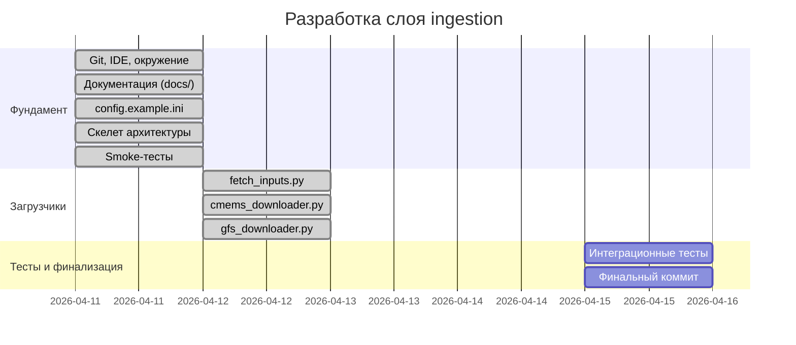
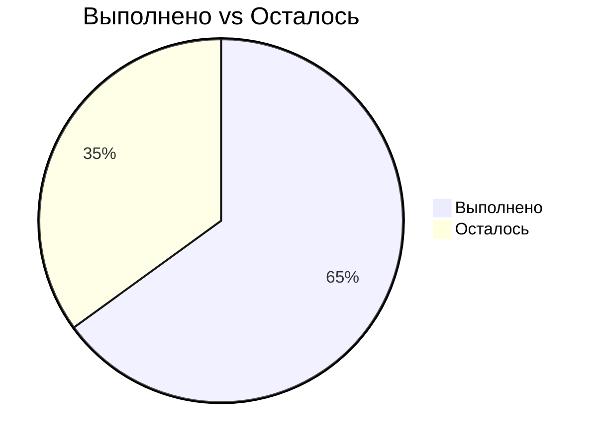

# Прогресс разработки hydromet_bulletin

## Статус по модулям

## Хронология сессий

| Сессия | Дата | Длительность | Результат |
|--------|------|-------------|-----------|
| 1 | 11.04.2026 | ~8 ч | Git, IDE, документация, скелет, smoke-тесты |
| 2 | 12.04.2026 | ~5 ч | config.ini, CMEMS + GFS реально работают |
| 3 | 13.04.2026 | ~3 ч | Рефакторинг config.ini (CMEMS_*/GFS_* секции), починка gfs_downloader.py (NOMADS filter + requests), починка cmems_downloader.py, smoke-тесты обоих загрузчиков (GFS: 40/40, 138.9s; CMEMS init: 0.001s) |

## Общий прогресс: ~65%

