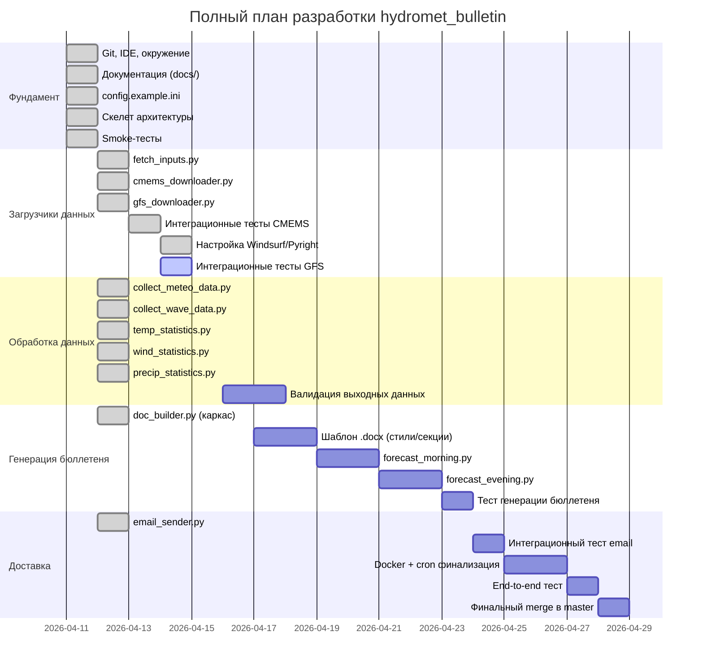
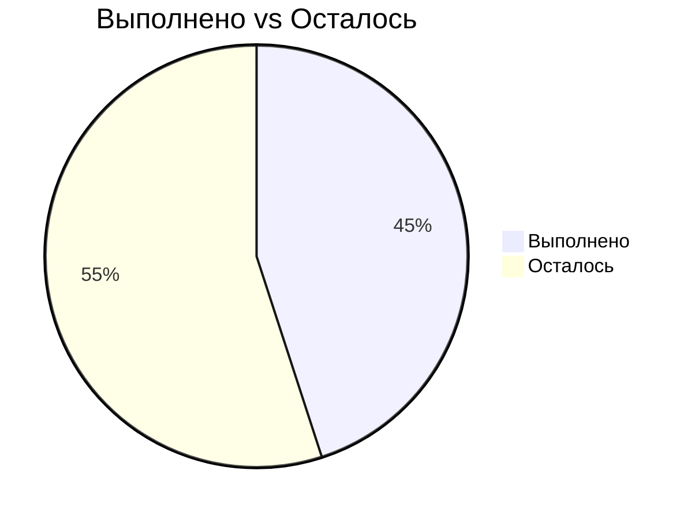

# Прогресс разработки hydromet_bulletin

## Статус по модулям

## Хронология сессий

| Сессия | Дата | Длительность | Результат |
|--------|------|--------------|-----------|
| 1 | 11.04.2026 | ~8 ч | Git, IDE, документация, скелет, smoke-тесты |
| 2 | 12.04.2026 | ~5 ч | config.ini, CMEMS + GFS реально работают |
| 3 | 13.04.2026 | ~3 ч | Рефакторинг config.ini, починка загрузчиков, smoke-тесты (GFS: 40/40, 138.9s) |
| 4 | 14.04.2026 | ~4 ч | Интеграционные тесты CMEMS (3/3 PASSED), настройка Windsurf/Pyright, интеграционные тесты GFS |

## Общий прогресс: ~45%

