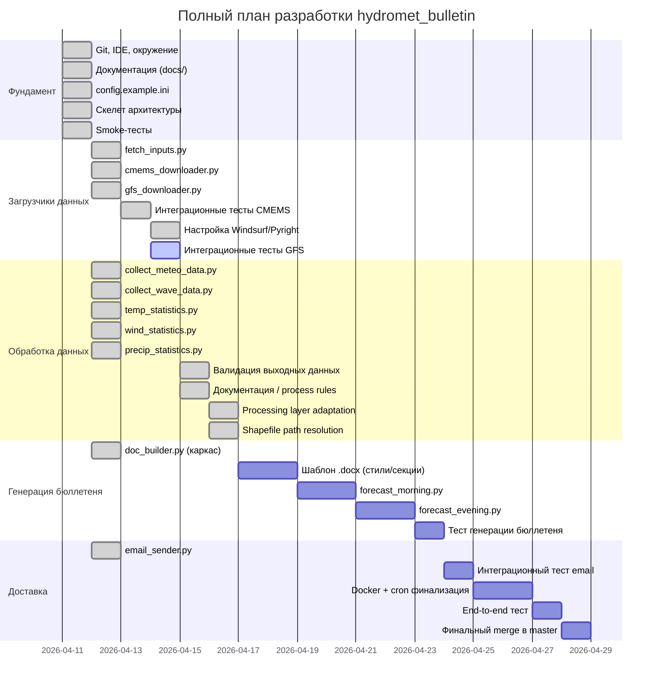
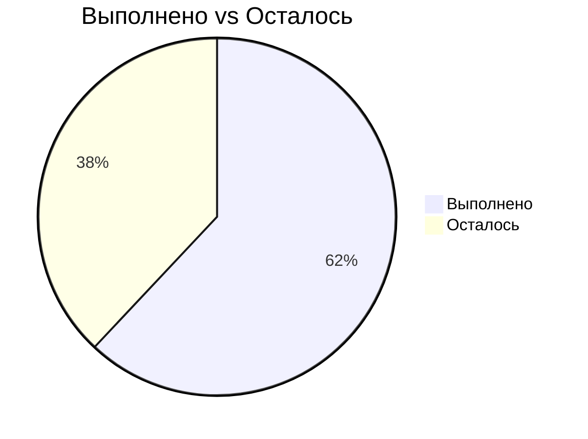

# Прогресс разработки hydromet_bulletin

## Статус по модулям

## Хронология сессий

| Сессия | Дата | Длительность | Результат |
|--------|------|--------------|-----------|
| 1 | 11.04.2026 | ~8 ч | Git, IDE, документация, скелет, smoke-тесты |
| 2 | 12.04.2026 | ~5 ч | config.ini, CMEMS + GFS реально работают |
| 3 | 13.04.2026 | ~3 ч | Рефакторинг config.ini, починка загрузчиков, smoke-тесты (GFS: 40/40, 138.9s) |
| 4 | 14.04.2026 | ~4 ч | Интеграционные тесты CMEMS (3/3 PASSED), настройка Windsurf/Pyright, интеграционные тесты GFS |
| 5 | 14–15.04.2026 | ~2 ч | Архитектурный анализ pipeline, выявлены риски валидации, согласован контракт validate_outputs.py |
| 6 | 15.04.2026 | ~3 ч | validate_outputs.py v1 (14/14 passed), guard-call в forecast_*.py, docs/process rules cleanup |
| 7 | 16.04.2026 | ~3 ч | Processing layer адаптирован под новый layout (GFS/CMEMS), legacy fallback, arch review Approve, follow-up правки |

## Общий прогресс: ~62%

## Deferred tasks

| ID | Задача | Приоритет | Этап |
|----|--------|-----------|------|
| DT-01 | GFS GRIB2 → NetCDF conversion / preprocessing | medium | После Processing layer adaptation |
| DT-02 | Normalizing/preprocessing layer для GFS | medium | После Processing layer adaptation |
| DT-03 | Downstream validation перед `doc_builder.py` | low | После validate_outputs v1 |
| DT-04 | Soft quality rules (физ. диапазоны, NaN ratio, sanity checks) | low | После MVP validate_outputs |
| DT-05 | Интеграционные тесты end-to-end (forecast → docx → email) | high | После Генерации бюллетеня |
| DT-07-1 | GFS cycle как явный параметр (`--cycle` CLI или `GFS_CYCLE_MORNING/EVENING`) | medium | Сессия 8 |
| DT-07-2 | `logger.info` resolved path для CMEMS в `_resolve_cmems_wave_dir()` | low | Сессия 8 или по необходимости |
| DT-07-3 | Unit-тесты для `_normalize_cycle` и absent-dir сценария | low | Сессия 8 |
| DT-08-1 | `_configure_logging()` ищет секцию `[Logging]`, в `config.example.ini` секция `[LOGGING]`. `configparser` чувствителен к регистру секций; feature `log_file` из `[LOGGING]`-секции не работает. Решение: привести регистр к единому виду. | low | Сессия 9 |
| DT-08-2 | При cron-пересечении morning + evening оба процесса пишут в один `hydromet.log` через раздельные `FileHandler` — строки могут чередоваться. Решение: раздельные `hydromet_morning.log` / `hydromet_evening.log` или `SocketHandler`. | medium | Сессия 9 |
| DT-08-3 | `FileHandler` пишет без ограничения размера; лог растёт неограниченно при ежедневном cron. Решение: `RotatingFileHandler(maxBytes=5MB, backupCount=7)`. | medium | Сессия 9 |
| DT-08-4 | Если процесс в Docker не под root, `mkdir` для `/app/logs/` может дать `PermissionError`. Решение: `RUN mkdir -p /app/logs && chown ...` в `Dockerfile`; проверить при следующем Docker-тесте. | medium | Сессия 9 |
| DT-08-5 | `test_retry_on_bad_url` — known flaky test: падает если `gfs.t00z.pgrb2.0p25.f006` уже существует локально (загрузчик делает skip, retry path не активируется). Решение: фикстура очистки кэша перед тестом или mock локального хранилища. | low | Сессия 9 |
| DT-08-6 | Нет unit-теста для `shapefile_dir=None` — проверки, что fallback строит `basedir/data/shapefiles`. Решение: добавить 1 unit-тест в `tests/test_processing_layout_paths.py`. | low | Сессия 9 |
| DT-08-7 | `shapefile_dir` стал вторым позиционным параметром в `collect_meteo_data()` / `collect_wave_data()`, что рискованно для callers с positional args. Решение: добавить `*` в сигнатуры для принудительного keyword-only. | low | Сессия 9 |

## Следующий этап (сессия 8)

**Выполнено в сессии 8:**
- Logging-fix (Blocker #1): `_configure_logging()` вынесен в функцию, динамический путь лога через `basedir`, arch review: Approve.
- Shapefile path resolution: шейп-файлы перенесены в `data/shapefiles/Kasp_Sea/`, путь через `shapefile_dir` в `[General]`, передаётся явным параметром в `collect_meteo_data()` / `collect_wave_data()`.
- Backward-compatibility review: чистый (все call sites обновлены, keyword args повсеместно).
- `docs/data_ingestion_design.md` обновлён: `shapefile=` → `shapefile_dir=` в call-примерах `collect_meteo_data()` / `collect_wave_data()`.
- DT-08-1–7 зафиксированы в canonical docs.

1. **Закрыть DT-07-3** — добавить 2–3 unit-теста в `tests/test_processing_layout_paths.py`: `_normalize_cycle` (граничные случаи) + сценарий "обе директории отсутствуют".
2. **Проработать DT-07-1** — определить policy cycle selection: единый `00z` или раздельные ключи `GFS_CYCLE_MORNING` / `GFS_CYCLE_EVENING` в `[GFS_SOURCES]`. Согласовать с пользователем до реализации.
3. **Перейти к следующему согласованному этапу** согласно `docs/project_context.md` — генерация бюллетеня (шаблон `.docx`, `forecast_morning.py` / `forecast_evening.py` полная реализация).
