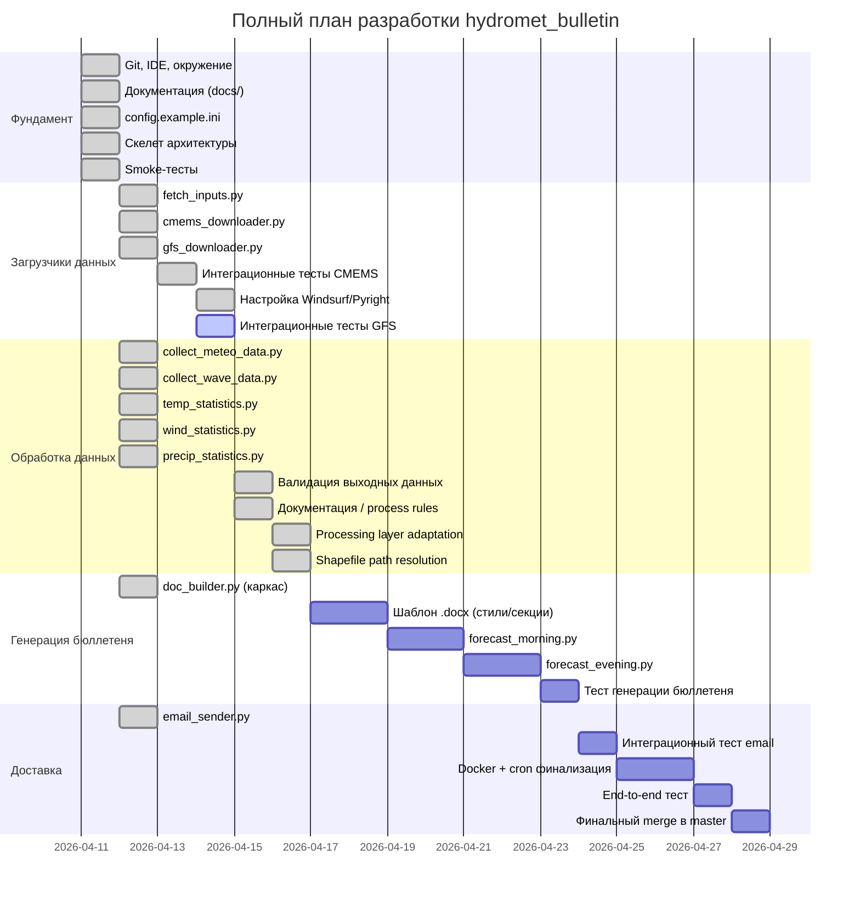
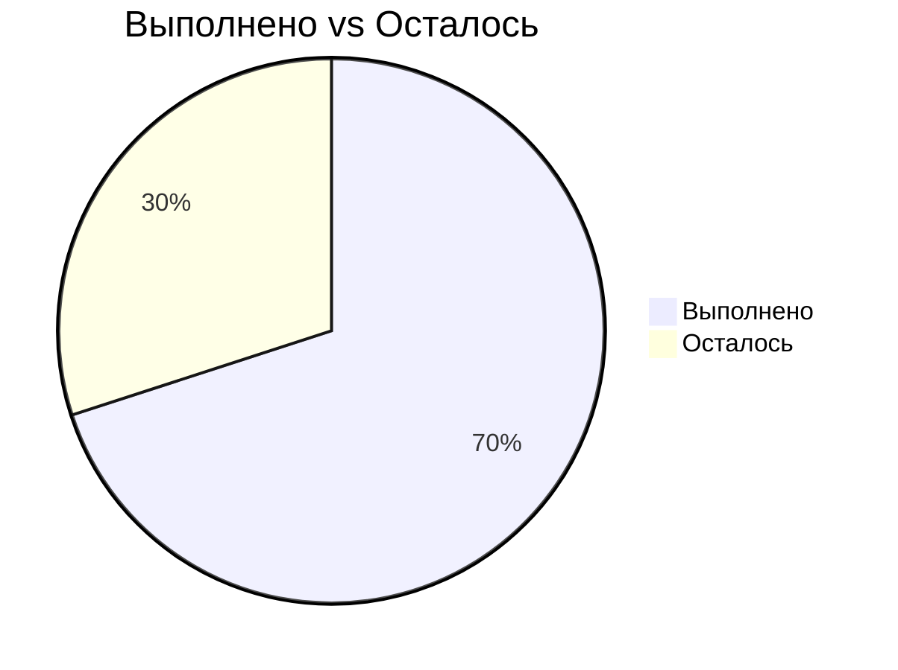

# Прогресс разработки hydromet_bulletin

## Статус по модулям

## Хронология сессий

| Сессия | Дата | Длительность | Результат |
|--------|------|--------------|-----------|
| 1 | 11.04.2026 | ~8 ч | Git, IDE, документация, скелет, smoke-тесты |
| 2 | 12.04.2026 | ~5 ч | config.ini, CMEMS + GFS реально работают |
| 3 | 13.04.2026 | ~3 ч | Рефакторинг config.ini, починка загрузчиков, smoke-тесты (GFS: 40/40, 138.9s) |
| 4 | 14.04.2026 | ~4 ч | Интеграционные тесты CMEMS (3/3 PASSED), настройка Windsurf/Pyright, интеграционные тесты GFS |
| 5 | 14–15.04.2026 | ~2 ч | Архитектурный анализ pipeline, выявлены риски валидации, согласован контракт validate_outputs.py |
| 6 | 15.04.2026 | ~3 ч | validate_outputs.py v1 (14/14 passed), guard-call в forecast_*.py, docs/process rules cleanup |
| 7 | 16.04.2026 | ~3 ч | Processing layer адаптирован под новый layout (GFS/CMEMS), legacy fallback, arch review Approve, follow-up правки |
| 8 | 16.04.2026 | ~4 ч | DT-07-3 закрыт, Blocker #1 (logging) + Blocker #2 (shapefile) устранены, arch review ×2 Approve, DT-08-1..7 зафиксированы |
| 9 | 16.04.2026 | ~2 ч | BOM-fix config.ini, import-fix collect_meteo_data, dry-run частично успешен, выявлен Blocker #3 (DT-01: GRIB2→NetCDF) |
| 10 | 17–18.04.2026 | ~5 ч | DT-01 реализован (Вариант A + follow-up convert_existing); первый end-to-end dry-run пройден до processing stage; 40/40 .nc созданы; новое падение: shape mismatch маски → Blocker #4 (DT-10-3) |
| 11 | 18.04.2026 | ~2 ч | Pre-work Windsurf: canonical axis contract, варианты A/B/C. Cursor: DT-10-3 закрыт (Вариант A, убран `.T`) + DT-10-4 закрыт (strict GRIB glob). Dry-run прошёл mask stage (236 ячеек), новое падение: FileNotFoundError в collect_wave_data (DT-11-1) |
| 12 | 19.04.2026 | в процессе | Pre-work Windsurf: CMEMS lookup contract, wave axis canon, DT-12-1. Cursor (acbcfba): DT-11-1 частично — 3-tier discovery. DT-12-1 открыт: wave массив в (lon,lat,5) vs канонических (lat,lon,5) |

## Общий прогресс: ~70%

## Deferred tasks

| ID | Задача | Приоритет | Этап |
|----|--------|-----------|------|
| DT-01 | ~~**[Blocker #3]**~~ **Закрыт (сессия 10, MVP).** GFS GRIB2 → NetCDF conversion: реализован Вариант A (`_convert_grib_to_netcdf` + `convert_existing` в `gfs_downloader.py`, sidecar `.nc`). 40/40 `.nc` создаются. `collect_meteo_data` находит и читает все 9 переменных. DoD подтверждён первым dry-run `forecast_morning.py --date 20260415`. | — | Закрыт |
| DT-10-1 | Unit/integration тест `_convert_grib_to_netcdf` с реальным `.pgrb2` — проверка маппинга переменных на реальных данных | medium | Сессия 11 |
| DT-10-2 | Изменить default `GFS_ENABLE_CONVERSION_TO_NETCDF` в `config.example.ini` с `false` на `true` | low | Сессия 11 |
| DT-10-3 | ~~**[Blocker #4]**~~ **Закрыт (сессия 11, Вариант A, 72c6557).** Удалён `.T` в meshgrid `collect_meteo_data.py`: `Lon, Lat = np.meshgrid(lon_arr, lat_arr)` (no `.T`). Маска `(721,1440)` совпадает с данными `(721,1440,n)`. Dry-run: `mask shape=(721,1440)`, `cells_inside=236`, `ValueError` снят. Downstream-чек: ни один downstream-модуль не предполагает `(n_lon, n_lat)` — все используют `[:,:,n]`. DoD выполнен. | — | Закрыт |
| DT-10-4 | ~~**[medium]**~~ **Закрыт (сессия 11, 72c6557).** `convert_existing()` glob теперь фильтрует `p.suffix.lower() != ".nc"` — sidecar `.nc`-файлы не открываются как GRIB2. Тест `test_convert_existing_skips_paths_with_nc_suffix_dt10_4` passed. | — | Закрыт |
| DT-10-5 | `_build_mask` Python-цикл 721×1440 (~1M ит.) через `shapely Point.within` — ~25–30 с. **Deferred** (сессия 11): фактическое время построения маски ~25–30 с не блокирует dry-run; оптимизация через `geopandas.sjoin` / bbox Каспия остаётся follow-up при росте времени выполнения. | low | Deferred (Режим X) |
| DT-10-6 | Симметрия `forecast_evening.py`: добавить `GFSDownloader.convert_existing()` pre-conversion hook аналогично `forecast_morning.py`. Без этого вечерний dry-run упадёт на `FileNotFoundError`. Дополнительно: `forecast_evening.py` использует устаревший import-стиль `from utils import collect_meteo_data`. **Deferred (Режим X).** | medium | Deferred (Режим X) |
| DT-11-1 | ~~**[Blocker #5]**~~ **Закрыт (сессия 12, Вариант A, acbcfba).** **Title:** CMEMS .nc not found for run\_date in collect\_wave\_data. **Root cause:** lookup mismatch (не «данные не загружены») — файлы CMEMS присутствовали в nested-структуре, но не находились прежней логикой. **Fix:** 3-tier discovery в `collect_wave_data.py` (flat `YYYYMMDD/` → nested `cmems/**/mfwamglocep_{run_date}*.nc` → legacy `waves/*.nc`) + диагностический вывод `Tried: [...]`. **Evidence:** dry-run `--date 20260415`: `CMEMS wave files resolved: count=2`, `collect_wave_data` проходит без `FileNotFoundError`. **DoD выполнен.** Код-коммит: `acbcfba16c34f1d2b16559a4fd244082420542f1` (локальный, push — только по команде пользователя). **Related:** DT-12-1 (axes, open), DT-12-2 (validation, open). | — | Закрыт |
| DT-12-1 | **[Blocker #7 — Сессия 12]** **Title:** wave axes MATLAB-legacy: `collect_wave_data` returns `(lon, lat, time)`. **Discovered:** session 12. **Symptom:** результат `collect_wave_data` имеет форму `(n_lon, n_lat, n_days)` вместо канонической `(n_lat, n_lon, n_days)`. **Root cause:** `.T` в `collect_wave_data.py` (строки ~185, 192, 216–218), аналог DT-10-3 в meteo-ветке. **Fix plan:** Вариант A (рекомендован) — убрать `.T` (аналог решения DT-10-3): транспозиция `(1,2,0)`, `H_Wave=(ny_full,nx_full,40)`, `np.ix_(lat_mask,lon_mask,...)`, убрать `.T` в meshgrid, docstring `(n_lat,n_lon,5)`; Вариант B — транспонировать данные (нежелательно); Вариант C — вместе с рефакторингом `validate_outputs` (не в этой сессии). **DoD:** wave-массив имеет форму `(n_lat, n_lon, n_days)`, lat-first; unit-тест фиксирует ориентацию; dry-run проходит `collect_wave_data` без регрессии `FileNotFoundError`. **Blocks:** корректная работа `validate_outputs` для wave; полный E2E до `.docx`. **Related:** DT-10-3 (closed), DT-11-1 (closed), DT-12-2 (suspected effect). | **high** | Сессия 12 |
| DT-12-2 | **[Blocker #8 — Сессия 12]** **Title:** `validate_outputs.assert_valid_for_bulletin` fails on wave horizon / high NaN after 3-tier discovery. **Discovered:** session 12, dry-run 20260415 после acbcfba. **Symptom:** `TemporalValidationError`, wave horizon 0 days, высокий NaN по волне. **Likely cause (hypothesis):** следствие DT-12-1 (оси `(lon,lat,time)` ломают временную/пространственную интерпретацию в `validate_outputs`); остаточная проблема данных не исключена (CMEMS даёт только 2 файла: 00 и 12) — требует повторной диагностики ПОСЛЕ фикса DT-12-1. **DoD:** либо симптомы исчезают после фикса DT-12-1 (тогда close), либо чётко сформулирован остаточный баг `validate_outputs` / данных, с отдельным планом. **Blocks:** полный E2E до `.docx`. **Related:** DT-12-1 (root cause suspect), DT-11-1 (closed). | **high** | Сессия 12 |
| DT-02 | Normalizing/preprocessing layer для GFS | medium | После Processing layer adaptation |
| DT-03 | Downstream validation перед `doc_builder.py` | low | После validate_outputs v1 |
| DT-04 | Soft quality rules (физ. диапазоны, NaN ratio, sanity checks) | low | После MVP validate_outputs |
| DT-05 | Интеграционные тесты end-to-end (forecast → docx → email) | high | После Генерации бюллетеня |
| DT-07-1 | GFS cycle как явный параметр (`--cycle` CLI или `GFS_CYCLE_MORNING/EVENING`) | medium | Сессия 8 |
| DT-07-2 | `logger.info` resolved path для CMEMS в `_resolve_cmems_wave_dir()` | low | Сессия 8 или по необходимости |
| DT-07-3 | Unit-тесты для `_normalize_cycle` и absent-dir сценария | low | Сессия 8 |
| DT-08-1 | `_configure_logging()` ищет секцию `[Logging]`, в `config.example.ini` секция `[LOGGING]`. `configparser` чувствителен к регистру секций; feature `log_file` из `[LOGGING]`-секции не работает. Решение: привести регистр к единому виду. | low | Сессия 9 |
| DT-08-2 | При cron-пересечении morning + evening оба процесса пишут в один `hydromet.log` через раздельные `FileHandler` — строки могут чередоваться. Решение: раздельные `hydromet_morning.log` / `hydromet_evening.log` или `SocketHandler`. | medium | Сессия 9 |
| DT-08-3 | `FileHandler` пишет без ограничения размера; лог растёт неограниченно при ежедневном cron. Решение: `RotatingFileHandler(maxBytes=5MB, backupCount=7)`. | medium | Сессия 9 |
| DT-08-4 | Если процесс в Docker не под root, `mkdir` для `/app/logs/` может дать `PermissionError`. Решение: `RUN mkdir -p /app/logs && chown ...` в `Dockerfile`; проверить при следующем Docker-тесте. | medium | Сессия 9 |
| DT-08-5 | `test_retry_on_bad_url` — known flaky test (падает если GRIB2 уже существует локально). **НЕ регресс сессии 11**: полный pytest: 42 passed, 1 failed (DT-08-5), 4 skipped — поведение идентично до фикса 72c6557. | low | Сессия 9 |
| DT-08-6 | Нет unit-теста для `shapefile_dir=None` — проверки, что fallback строит `basedir/data/shapefiles`. Решение: добавить 1 unit-тест в `tests/test_processing_layout_paths.py`. | low | Сессия 9 |
| DT-08-7 | `shapefile_dir` стал вторым позиционным параметром в `collect_meteo_data()` / `collect_wave_data()`, что рискованно для callers с positional args. Решение: добавить `*` в сигнатуры для принудительного keyword-only. | low | Сессия 9 |

## Сессия 11 — итоги и следующий этап (сессия 12)

**Выполнено в сессии 11:**
- Pre-work Windsurf (8413a67): canonical axis contract, варианты A/B/C в docs.
- DT-10-3 ✅ закрыт (Cursor, 72c6557, Вариант A): убран `.T`, маска `(721,1440)`, 236 ячеек внутри акватории.
- DT-10-4 ✅ закрыт (Cursor, 72c6557): strict GRIB glob в `convert_existing`.
- DT-10-5 deferred: ~25–30 с не блокирует dry-run.
- Тесты: 23 passed + 1 xfailed, 42 passed + 1 failed (DT-08-5, не регресс).
- DoD сессии 11 ✅:
  - `ValueError` на broadcast-маске устранён
  - dry-run проходит `collect_meteo_data`, доходит до `collect_wave_data`
  - контракт ingestion/processing не нарушен
  - целевые тесты: 23 passed, 1 xfailed
  - полный pytest: 42 passed, 1 failed (DT-08-5 known flaky, не регресс), 4 skipped
- Новый blocker: DT-11-1 (CMEMS `.nc` not found).

**Downstream-чеклист (Windsurf, сессия 11):**

| Модуль | Результат |
|---|---|
| `forecast_morning.py` стр. 121–138 | uses (lat, lon, time): OK |
| `forecast_evening.py` стр. 116–133 | uses (lat, lon, time): OK |
| `wind_statistics.py` | uses (lat, lon, time): OK |
| `precip_statistics.py` | uses (lat, lon, time): OK |
| `temp_statistics.py` | uses (lat, lon, time): OK |
| `validate_outputs.py` | uses (lat, lon, time): OK |

*DT-11-2 не создавался: подозрительных мест с `(lon, lat, ...)` не обнаружено.*

## Сессия 12 — план (Режим X: критический путь до .docx)

**Git policy сессии 12:**
- Cursor накапливает код-коммиты ЛОКАЛЬНО поверх `72c6557` и `acbcfba`.
- Windsurf пушит только docs-коммиты.
- Единый push всех локальных код-коммитов выполняется в финальном шаге сессии 12 по явной команде пользователя.

**Режим X — только критический путь:**
Закрываем в сессии 12: **DT-11-1** (закрыт acbcfba), **DT-12-1** (axes), **DT-12-2** (validation). Stretch: E2E dry-run до `.docx`.

**Осознанный deferred (НЕ в scope сессии 12, отдельная sweep-сессия после успешного E2E):**

| ID | Причина deferred |
|----|------------------|
| DT-10-5 | ~25–30 с не блокирует; оптимизация отдельной sweep-сессией |
| DT-10-6 | `forecast_evening.py` симметрия — sweep-сессия после успешного E2E morning |
| DT-07-1 | GFS cycle CLI-параметр — отдельный PR |
| DT-08-1..4, 6, 7 | Logging, Docker, unit-tests — sweep-сессия |
| DT-08-5 | Known flaky, не регресс; мониторинг без фиксации |

**Задачи Cursor (локально, Режим X):**

| # | Задача | DT |
|---|--------|-----|
| 1 | Исправить ориентацию осей в `collect_wave_data.py` (Вариант A) | DT-12-1 |
| 2 | Диагностика `TemporalValidationError` после фикса DT-12-1 | DT-12-2 |
| 3 | Повторный dry-run: `collect_wave_data` → статистика → `.docx` | stretch |

**После отчёта Cursor (post-work Windsurf):**
1. Прочитать diff всех локальных коммитов Cursor поверх `acbcfba`.
2. Arch review: оси `(lat,lon,time)` восстановлены, `validate_outputs` проходит, E2E до `.docx`.
3. Downstream-чек wave callers: `forecast_morning.py`, `forecast_evening.py`, `doc_builder.py`.
4. Обновить docs + коммит + push (только после явной команды).
