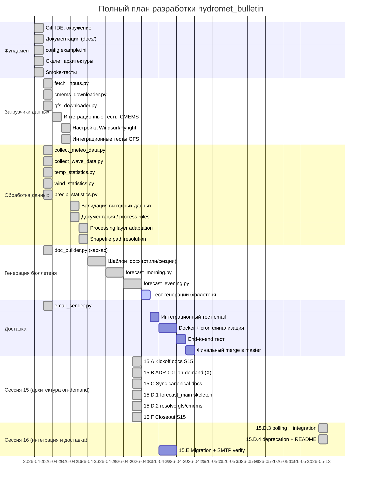
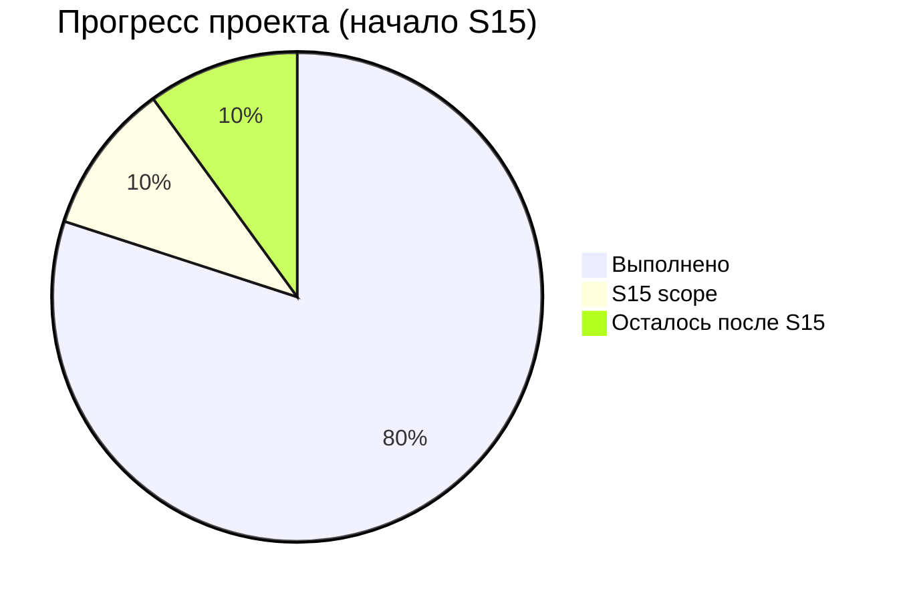
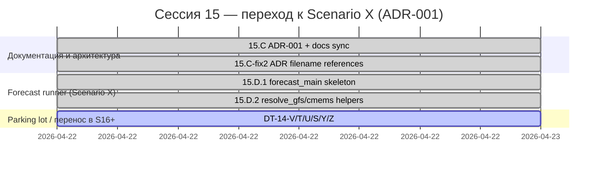

# Прогресс разработки hydromet_bulletin

## Статус по модулям

## Хронология сессий

| Сессия | Дата | Длительность | Результат |
|--------|------|--------------|-----------|
| 1 | 11.04.2026 | ~8 ч | Git, IDE, документация, скелет, smoke-тесты |
| 2 | 12.04.2026 | ~5 ч | config.ini, CMEMS + GFS реально работают |
| 3 | 13.04.2026 | ~3 ч | Рефакторинг config.ini, починка загрузчиков, smoke-тесты (GFS: 40/40, 138.9s) |
| 4 | 14.04.2026 | ~4 ч | Интеграционные тесты CMEMS (3/3 PASSED), настройка Windsurf/Pyright, интеграционные тесты GFS |
| 5 | 14–15.04.2026 | ~2 ч | Архитектурный анализ pipeline, выявлены риски валидации, согласован контракт validate_outputs.py |
| 6 | 15.04.2026 | ~3 ч | validate_outputs.py v1 (14/14 passed), guard-call в forecast_*.py, docs/process rules cleanup |
| 7 | 16.04.2026 | ~3 ч | Processing layer адаптирован под новый layout (GFS/CMEMS), legacy fallback, arch review Approve, follow-up правки |
| 8 | 16.04.2026 | ~4 ч | DT-07-3 закрыт, Blocker #1 (logging) + Blocker #2 (shapefile) устранены, arch review ×2 Approve, DT-08-1..7 зафиксированы |
| 9 | 16.04.2026 | ~2 ч | BOM-fix config.ini, import-fix collect_meteo_data, dry-run частично успешен, выявлен Blocker #3 (DT-01: GRIB2→NetCDF) |
| 10 | 17–18.04.2026 | ~5 ч | DT-01 реализован (Вариант A + follow-up convert_existing); первый end-to-end dry-run пройден до processing stage; 40/40 .nc созданы; новое падение: shape mismatch маски → Blocker #4 (DT-10-3) |
| 11 | 18.04.2026 | ~2 ч | Pre-work Windsurf: canonical axis contract, варианты A/B/C. Cursor: DT-10-3 закрыт (Вариант A, убран `.T`) + DT-10-4 закрыт (strict GRIB glob). Dry-run прошёл mask stage (236 ячеек), новое падение: FileNotFoundError в collect_wave_data (DT-11-1) |
| 12 | 19.04.2026 | ~3 ч | DT-11-1 закрыт (3-tier CMEMS discovery) + DT-12-1 закрыт (wave axis canon); изолирован DT-12-2 (temporal validation) |
| 13 | 20.04.2026 | ~4 ч | DT-12-2 (temporal validation) закрыт; `forecast_days`→`forecast_hours` (DT-13-1); CMEMS-only dry-run policy (DT-13-2); выявлены DT-13-3/4/6 |
| 14 | 21–22.04.2026 | ~5 ч | Dry-run → `.docx` end-to-end; DT-13-3/4 закрыты; аудит DT-13-6; parking lot DT-14-S/T/U/V/Y/Z зафиксированы |
| 15 | 22.04.2026 | ~6 ч (13:00–19:00 MSK) | ADR-001 on-demand (X-variant) зафиксирован; `forecast_main.py` skeleton + CLI + `msk_to_utc` + `resolve_gfs_cycle` + `resolve_cmems_layer` (31 passed); canonical docs синхронизированы; `.gitignore` cleanup (DT-15-A); 15.D.3/D.4/15.E перенесены в S16 |

## Общий прогресс

Общий прогресс: **64%**

Примечание: формат «Общий прогресс: **NN%**» — машинно-обновляемый,
процент пересчитывается автоматически по mermaid-gantt
(done / total задач, где section-заголовки и active/pending не считаются done).
Снижение относительно предыдущего значения «~80% на начало S15»
связано с расширением gantt новой секцией «Сессия 15 (архитектура on-demand)»
и детализацией оставшихся задач, а не с регрессом по факту сделанного.

**Прогноз к концу S15:** ~90% при закрытии DT-14-V + DT-14-U + 3-of-3 should (T, S, Y).

### Открытые DT на вход S16 (по итогам S15)
- **DT-14-V** unified forecast CLI — **near-complete (final on S16 closeout)**: skeleton + argparse + `msk_to_utc` + `resolve_gfs_cycle` + `resolve_cmems_layer` закрыты в S15; ingestion + deprecation закрыты в 15.D.3/D.4; pipeline glue + `.docx` закрыты в 15.E.1; email-слой + exit codes закрыты в 15.E.2. Финальная пометка — 15.E.3.
- **DT-14-U** email delivery verification on prod corporate SMTP — **deferred (S17.1 prerequisite + manual verify)**.
- **DT-14-T** `.docx` filename convention `Прогноз_{cycle}_{start_date}.docx` — **closed (15.D.4, `526e549`)**.
- **DT-14-S** `RuntimeWarning: Mean of empty slice` in `collect_wave_data.py` — не трогалось в S15; остаётся открытым для S16+.
- **DT-14-Y** pipeline exit codes propagation (0/1/2/3/>=10) — **closed (15.E.2, `4083d37`)**.
- **DT-14-Z** scheduled ingestion + archive rotation — **closed (15.D.3-2, `f9fb17a`; semantics → DT-16-2)**.
- **DT-15-A** cleanup untracked debug artifacts — закрыт в 15.F через расширение `.gitignore`.
- **DT-16-1** manifest.gfs.storage_path contract alignment — **open (S17.1)**.
- **DT-16-2** archive rotation semantics (before vs after download) — **open (S17.1)**.
- **DT-16-3** forecast_main start_time ceil per ADR-001 — **open (S17.2)**.
- **DT-16-4** strict-manifest mode in forecast_main — **open (S17.2)**.
- **DT-16-5** README cleanup of legacy operational commands — **open (15.E.3)**.

## Deferred tasks

| ID | Задача | Приоритет | Этап |
|----|--------|-----------|------|
| DT-01 | ~~**[Blocker #3]**~~ **Закрыт (сессия 10, MVP).** GFS GRIB2 → NetCDF conversion: реализован Вариант A (`_convert_grib_to_netcdf` + `convert_existing` в `gfs_downloader.py`, sidecar `.nc`). 40/40 `.nc` создаются. `collect_meteo_data` находит и читает все 9 переменных. DoD подтверждён первым dry-run `forecast_morning.py --date 20260415`. | — | Закрыт |
| DT-10-1 | Unit/integration тест `_convert_grib_to_netcdf` с реальным `.pgrb2` — проверка маппинга переменных на реальных данных | medium | Сессия 11 |
| DT-10-2 | Изменить default `GFS_ENABLE_CONVERSION_TO_NETCDF` в `config.example.ini` с `false` на `true` | low | Сессия 11 |
| DT-10-3 | ~~**[Blocker #4]**~~ **Закрыт (сессия 11, Вариант A, 72c6557).** Удалён `.T` в meshgrid `collect_meteo_data.py`: `Lon, Lat = np.meshgrid(lon_arr, lat_arr)` (no `.T`). Маска `(721,1440)` совпадает с данными `(721,1440,n)`. Dry-run: `mask shape=(721,1440)`, `cells_inside=236`, `ValueError` снят. Downstream-чек: ни один downstream-модуль не предполагает `(n_lon, n_lat)` — все используют `[:,:,n]`. DoD выполнен. | — | Закрыт |
| DT-10-4 | ~~**[medium]**~~ **Закрыт (сессия 11, 72c6557).** `convert_existing()` glob теперь фильтрует `p.suffix.lower() != ".nc"` — sidecar `.nc`-файлы не открываются как GRIB2. Тест `test_convert_existing_skips_paths_with_nc_suffix_dt10_4` passed. | — | Закрыт |
| DT-10-5 | `_build_mask` Python-цикл 721×1440 (~1M ит.) через `shapely Point.within` — ~25–30 с. **Deferred** (сессия 11): фактическое время построения маски ~25–30 с не блокирует dry-run; оптимизация через `geopandas.sjoin` / bbox Каспия остаётся follow-up при росте времени выполнения. | low | Deferred (Режим X) |
| DT-10-6 | Симметрия `forecast_evening.py`: добавить `GFSDownloader.convert_existing()` pre-conversion hook аналогично `forecast_morning.py`. Без этого вечерний dry-run упадёт на `FileNotFoundError`. Дополнительно: `forecast_evening.py` использует устаревший import-стиль `from utils import collect_meteo_data`. **Deferred (Режим X).** | medium | Deferred (Режим X) |
| DT-11-1 | ~~**[Blocker #5]**~~ **Закрыт (сессия 12, Вариант A, acbcfba).** **Title:** CMEMS .nc not found for run\_date in collect\_wave\_data. **Root cause:** lookup mismatch (не «данные не загружены») — файлы CMEMS присутствовали в nested-структуре, но не находились прежней логикой. **Fix:** 3-tier discovery в `collect_wave_data.py` (flat `YYYYMMDD/` → nested `cmems/**/mfwamglocep_{run_date}*.nc` → legacy `waves/*.nc`) + диагностический вывод `Tried: [...]`. **Evidence:** dry-run `--date 20260415`: `CMEMS wave files resolved: count=2`, `collect_wave_data` проходит без `FileNotFoundError`. **DoD выполнен.** Код-коммит: `acbcfba16c34f1d2b16559a4fd244082420542f1` (локальный, push — только по команде пользователя). **Related:** DT-12-1 (axes, open), DT-12-2 (validation, open). | — | Закрыт |
| DT-12-1 | ~~**[Blocker #7]**~~ **Закрыт (сессия 12, Вариант A, 75cf010).** **Title:** wave axes MATLAB-legacy: `collect_wave_data` returns `(lon, lat, time)`. **Root cause:** `.T` в `collect_wave_data.py` (стр. ~185, 192, 216–218). **Fix (75cf010):** удалены legacy `.T` у meshgrid; 3D transpose CMEMS заменён на 2D-срезы `H_Wave[:, :, slot] = hw[t, :, :]`; без новых `transpose`/`ix_`; индексация `H_Wave[lat_mask, :, :][:, lon_mask, :]`. **Evidence:** dry-run 20260415: `Hwave=(73,109,40)`, `mask=(73,109)`, `inside=2202`; `collect_wave_data` проходит без `FileNotFoundError`. **DoD выполнен.** **Related:** DT-10-3 (closed), DT-11-1 (closed), DT-12-2 (open, confirmed separate root cause). | — | Закрыт |
| DT-12-2 | ~~**[IN PROGRESS]**~~ **Закрыт (сессия 13, коммиты fffc359 + d377661).** **Title:** wave temporal validation after DT-12-1 fix. **Discovered:** session 12, dry-run `py forecast_morning.py --date 20260415` after 75cf010. **Symptom:** `TemporalValidationError` from `validate_outputs._validate_dates`: "Wave horizon looks suspicious: 0 day(s)"; Warning: NaN ratio ~99.98% in wave array under strict thresholds (`validate_wave_output`). **Stage:** `validate_outputs.assert_valid_for_bulletin(strict=True)`, после успешного прохождения `collect_wave_data`. **Root cause (confirmed):** `start_date` и `end_date` в `collect_wave_data` берутся как `time_arr[0]` из первого и последнего `.nc` соответственно; при наборе из 2 файлов (00 и 12 одной даты) оба timestamp на один и тот же день → Δdays = 0. **Explicit non-cause:** (a) ориентация осей (DT-12-1 закрыт, `Hwave=(73,109,40)`, `mask=(73,109)`, broadcast проходит); (b) «subdaily coverage» и «недостаточно CMEMS файлов» — опровергнуто: CMEMS нормативно возвращает штатный набор из 4 отсечек × 12 ч × 2 файла/сутки, перекрытий нет. **Part 1 — закрыт (fffc359 local):** min/max по union(`time_arr_all`) в `collect_wave_data`; `time_arr_all = concat(time_arr_f0,...,fN)`. **Part 2 — закрыт (d377661):** `_validate_dates` переписан: `horizon_hours_actual = (end − start).total_seconds() / 3600.0`; проверка `horizon_hours_actual >= forecast_hours − tol_hours`. Dry-run 20260415: `horizon_hours_actual = 21.0h`, `forecast_hours = 24h`, `tol_hours = 3` → pass (21.0 >= 24 − 3). **tol_hours = 3 — нормативное значение** (зафиксировано в docs; код-реализация tol_hours = 3 — стартовая микро-задача сессии 14). Stretch .docx не достигнут (блокеры DT-13-3 + DT-13-4). **Вариант 1** (min/max логика дат в `collect_wave_data`) — **Part 1, закрыт (fffc359 local).** **Вариант 2** (переход `validate_outputs._validate_dates` с `.days` на сравнение в часах с `forecast_hours`) — **основной путь Part 2 DT-12-2 в 13.B** (переписывание семантики, не «калибровка порогов»). **Вариант 3** (догрузка полного набора CMEMS) — **rescinded (13.A.2)**: CMEMS нормативно возвращает штатный набор из 4 отсечек × 12 ч × 2 файла/сутки, перекрытий нет, «догрузка» неприменима. **DoD DT-12-2 / DoD сессии 13:** (a) Part 2: `_validate_dates` оперирует часами; `(end − start).total_seconds() / 3600` vs `forecast_hours`; strict-проход на dry-run today/today-1; (b) DT-13-1: `forecast_hours` действующий ключ, compat-window β, CLI-флаг `--forecast-hours`, `config.ini`/`config.example.ini` согласованы на 120; (c) 3-tier DT-11-1 не регрессировал; (d) axes canon DT-12-1 не регрессировал; (e) `fffc359` (Part 1) не тронут; (f) целевые pytest зелёные; полный pytest — только DT-08-5 known flaky; (g) stretch: `.docx` сгенерирован. **Частичный DoD допустим:** если Part 2 реализован, но `.docx` не сгенерирован по причине вне scope processing/validation — фиксируется новым DT со строгой root cause. **Related:** DT-12-1 (closed, explicit non-cause), DT-11-1 (closed), DT-13-1 (closed), DT-13-2 (closed by scope), DT-13-3 (open, session 14). | — | Закрыт |
| DT-13-1 | ~~**[ready-for-implementation]**~~ **Закрыт (сессия 13, коммиты 8e56709 + 8055651).** **Title:** `forecast_days` → `forecast_hours` migration (compat-window β). **Scope:** (1) добавить ключ `forecast_hours` в `[CMEMS_FORECAST]` в `config.example.ini` (дефолт 120 = 5 сут × 24 ч); привести `config.ini` к значению 120; (2) в коде читать `forecast_hours`; при отсутствии — fallback `forecast_days × 24` с deprecation warning в логах; (3) CLI-флаг `--forecast-hours` у `forecast_morning.py` и `forecast_evening.py`; CLI override над config. **Non-scope в 13.B:** удаление `forecast_days` (откладывается в sweep-сессию); переименование других ключей конфига. **Note (superseded):** прежняя формулировка DT-13-1 от Cursor (13.B) как «data coverage issue» — отменена в шаге 13.A.2 как построенная на неверной root cause (CMEMS нормативно возвращает штатный набор). Текущая формулировка является заменой. **Evidence:** pytest 13.B целевые 47 passed, 1 xfailed; `test_cmems_forecast_hours_config.py` included. `forecast_days` не удалён (deprecated fallback до sweep). | — | Закрыт |
 | DT-13-2 | ~~**[ready-for-implementation]**~~ **Закрыт по scope (сессия 13, коммит 8055651); insufficient for full E2E — см. DT-13-3.** **Title:** dry-run date policy enforcement in `forecast_morning.py` / `forecast_evening.py`. **Реализовано (8055651):** `_resolve_run_date_for_dry_run`: explicit `--date` отключает fallback; без `--date` — today (UTC), fallback today-1, иначе `FileNotFoundError "No CMEMS .nc for today UTC nor today-1; check ingestion"`; проверка через `_discover_cmems_nc_files` — только CMEMS. **Nota bene:** GFS availability не проверяется — это и есть DT-13-3. **Related:** DT-12-2 Part 2, DT-13-3. | — | Закрыт по scope |
 | DT-13-3 | ~~**[OPEN / HIGH — сессия 14, critical path]**~~ **Закрыт (сессия 14, 90523af).** **Title:** date policy не учитывает GFS. **Fix (90523af):** `_resolve_run_date_for_dry_run` проверяет наличие GFS в storage; при отсутствии за today (UTC) откатывается на today-1; поведение explicit `--date` не меняется. **DoD:** dry-run без `--date` корректно выбирает дату с совместным наличием CMEMS+GFS и не падает в `collect_meteo_data`. | **high** | Закрыт |
 | DT-13-4 | ~~**[OPEN / HIGH — сессия 14, critical path, clean migration]**~~ **Закрыт (сессия 14, bd70c79 + 6efa10e).** **Title:** storage layout mismatch — legacy default `results_subdir` и wave-side контракт CMEMS. **Fix:** meteo-side (bd70c79) — дефолтный `results_subdir` мигрирован на `data/storage/gfs` с legacy fallback; wave-side (6efa10e) — CMEMS contract и discovery приведены к `R<run_date>` + NaN/fill-value/nanmean. **DoD:** pipeline использует новый layout без caller overrides; full dry-run до `.docx` пройден. | **high** | Закрыт |
 | DT-13-6 | ~~**[OPEN / LOW — sweep-сессия]** **Частично закрыт (сессия 14, audit verdict).** `files_per_cycle` и ряд ключей в `[CMEMS_SOURCES]` оказались мёртвыми (не читаются кодом). Принято решение **B**: оставить ключи как `legacy/reserved` (без удаления) и зафиксировать в docs; cleanup конфига — отдельный sweep при необходимости. | **low** | Частично закрыт |
 | DT-14-Z | scheduled ingestion + archive rotation для CMEMS/GFS. | medium | Parking lot |
 | DT-02 | Normalizing/preprocessing layer для GFS | medium | После Processing layer adaptation |
 | DT-03 | Downstream validation перед `doc_builder.py` | low | После validate_outputs v1 |
 | DT-04 | Soft quality rules (физ. диапазоны, NaN ratio, sanity checks) | low | После MVP validate_outputs |
| DT-05 | Интеграционные тесты end-to-end (forecast → docx → email) | high | После Генерации бюллетеня |
| DT-07-1 | GFS cycle как явный параметр (`--cycle` CLI или `GFS_CYCLE_MORNING/EVENING`) | medium | Сессия 8 |
| DT-07-2 | `logger.info` resolved path для CMEMS в `_resolve_cmems_wave_dir()` | low | Сессия 8 или по необходимости |
| DT-07-3 | Unit-тесты для `_normalize_cycle` и absent-dir сценария | low | Сессия 8 |
| DT-08-1 | `_configure_logging()` ищет секцию `[Logging]`, в `config.example.ini` секция `[LOGGING]`. `configparser` чувствителен к регистру секций; feature `log_file` из `[LOGGING]`-секции не работает. Решение: привести регистр к единому виду. | low | Сессия 9 |
| DT-08-2 | При cron-пересечении morning + evening оба процесса пишут в один `hydromet.log` через раздельные `FileHandler` — строки могут чередоваться. Решение: раздельные `hydromet_morning.log` / `hydromet_evening.log` или `SocketHandler`. | medium | Сессия 9 |
| DT-08-3 | `FileHandler` пишет без ограничения размера; лог растёт неограниченно при ежедневном cron. Решение: `RotatingFileHandler(maxBytes=5MB, backupCount=7)`. | medium | Сессия 9 |
| DT-08-4 | Если процесс в Docker не под root, `mkdir` для `/app/logs/` может дать `PermissionError`. Решение: `RUN mkdir -p /app/logs && chown ...` в `Dockerfile`; проверить при следующем Docker-тесте. | medium | Сессия 9 |
| DT-08-5 | `test_retry_on_bad_url` — known flaky test (падает если GRIB2 уже существует локально). **НЕ регресс сессии 11**: полный pytest: 42 passed, 1 failed (DT-08-5), 4 skipped — поведение идентично до фикса 72c6557. **НЕ регресс сессии 12:** полный pytest сессии 12: 46 passed, 1 failed (DT-08-5); целевые тесты: 20 passed + 1 xfailed. **НЕ регресс сессии 13:** полный pytest 13.B: 59 passed, 1 failed (DT-08-5), 4 skipped, 1 xfailed; целевые тесты 13.B: 47 passed, 1 xfailed. | low | Deferred (Режим X) |
| DT-08-6 | Нет unit-теста для `shapefile_dir=None` — проверки, что fallback строит `basedir/data/shapefiles`. Решение: добавить 1 unit-тест в `tests/test_processing_layout_paths.py`. | low | Сессия 9 |
| DT-08-7 | `shapefile_dir` стал вторым позиционным параметром в `collect_meteo_data()` / `collect_wave_data()`, что рискованно для callers с positional args. Решение: добавить `*` в сигнатуры для принудительного keyword-only. | low | Сессия 9 |

## Сессия 11 — итоги и следующий этап (сессия 12)

**Выполнено в сессии 11:**
- Pre-work Windsurf (8413a67): canonical axis contract, варианты A/B/C в docs.
- DT-10-3 ✅ закрыт (Cursor, 72c6557, Вариант A): убран `.T`, маска `(721,1440)`, 236 ячеек внутри акватории.
- DT-10-4 ✅ закрыт (Cursor, 72c6557): strict GRIB glob в `convert_existing`.
- DT-10-5 deferred: ~25–30 с не блокирует dry-run.
- Тесты: 23 passed + 1 xfailed, 42 passed + 1 failed (DT-08-5, не регресс).
- DoD сессии 11 ✅:
  - `ValueError` на broadcast-маске устранён
  - dry-run проходит `collect_meteo_data`, доходит до `collect_wave_data`
  - контракт ingestion/processing не нарушен
  - целевые тесты: 23 passed, 1 xfailed
  - полный pytest: 42 passed, 1 failed (DT-08-5 known flaky, не регресс), 4 skipped
- Новый blocker: DT-11-1 (CMEMS `.nc` not found).

**Downstream-чеклист (Windsurf, сессия 11):**

| Модуль | Результат |
|---|---|
| `forecast_morning.py` стр. 121–138 | uses (lat, lon, time): OK |
| `forecast_evening.py` стр. 116–133 | uses (lat, lon, time): OK |
| `wind_statistics.py` | uses (lat, lon, time): OK |
| `precip_statistics.py` | uses (lat, lon, time): OK |
| `temp_statistics.py` | uses (lat, lon, time): OK |
| `validate_outputs.py` | uses (lat, lon, time): OK |

*DT-11-2 не создавался: подозрительных мест с `(lon, lat, ...)` не обнаружено.*

## Сессия 12 — итоги (Режим X)

**Git policy сессии 12 (выполнена):**
- `72c6557` (DT-10-3/4) и `acbcfba` (DT-11-1) — были на origin до шага 12.C.
- `75cf010` (DT-12-1 axes) — запушен в финальном шаге 12.C по команде пользователя.

**DoD сессии 12 ✅:**
- DT-11-1 ✅ closed (локальный lookup mismatch + 3-tier discovery, acbcfba)
- DT-12-1 ✅ closed (axes, Вариант A, 75cf010)
- DT-12-2 ⚠️ изолирован и переформулирован: root cause — Дdays=0 (даты считаются как time_arr[0] из 2 файлов 00+12); не связан с DT-12-1
- pipeline проходит collect_meteo_data и collect_wave_data ✅
- контракт ingestion/processing не нарушен ✅
- stretch до .docx не достигнут (DT-12-2 open, сессия 13)
- целевые тесты: 20 passed + 1 xfailed ✅
- полный pytest: 46 passed + 1 failed (DT-08-5 known flaky, не регресс) ✅
- единый push всех локальных код-коммитов выполнен в шаге 12.C ✅

**Downstream-чеклист wave axis canon (Windsurf, сессия 12):**

| Модуль | Результат |
|--------|----------|
| `forecast_morning.py` стр. 134–135 | `HWave[:, :, n]` — axis-neutral (lat,lon,time): OK |
| `forecast_evening.py` стр. 129–130 | `HWave[:, :, n]` — axis-neutral (lat,lon,time): OK |
| `validate_outputs.py` | `arr[:, :, idx]`, `arr.shape[2]` — axis-neutral: OK |
| `doc_builder.py` | wave не используется напрямую: OK |
| статистические модули | wave не передаётся в stats-модули (inline nanmin/nanmax): OK |

*DT-12-3 не создавался: подозрительных мест с предположением (lon,lat,...) порядка волны не обнаружено.*

**Осознанный deferred (Режим X, sweep-сессия после E2E):**

| ID | Причина deferred |
|----|------------------|
| DT-10-5 | ~25–30 с не блокирует; sweep-сессия |
| DT-10-6 | `forecast_evening.py` симметрия; sweep-сессия |
| DT-07-1 | GFS cycle CLI — отдельный PR |
| DT-08-1..4, 6, 7 | Logging, Docker, unit-tests — sweep-сессия |
| DT-08-5 | Known flaky, мониторинг без фиксации |

## Сессия 13 — итоги (шаг 13.C: финал)

**Выполнено в сессии 13:**
- Pre-work Windsurf (cc96416, 8e942d7): CMEMS нормативный блок, re-scope DT-12-2 Part 1/2, DT-13-1, DT-13-2, Вариант 3 rescinded.
- DT-12-2 Part 1 ✅ закрыт (Cursor, fffc359): min/max по union(time_arr) в `collect_wave_data`.
- DT-12-2 Part 2 ✅ закрыт (Cursor, d377661): `_validate_dates` → часы; `horizon_hours_actual >= forecast_hours − tol_hours`. tol_hours = 3 нормативное значение (код-реализация — сессия 14).
- DT-13-1 ✅ закрыт (Cursor, 8e56709 + 8055651): compat-window β; `forecast_hours` приоритет; CLI `--forecast-hours`; config согласованы на 120.
- DT-13-2 ✅ закрыт по scope (Cursor, 8055651): CMEMS-only fallback; GFS не проверяется → DT-13-3.
- Диагностика 13.B: выявлены DT-13-3, DT-13-4, DT-13-6.
- Тесты 13.B: целевые 47 passed, 1 xfailed; полный 59 passed, 1 failed (DT-08-5 known flaky), 4 skipped, 1 xfailed.
- Stretch .docx не достигнут: блокеры DT-13-3 + DT-13-4.

**DoD сессии 13 ✅:**
- (a) DT-12-2 Part 2 closed в docs; tol_hours = 3 нормативное значение; код-реализация — стартовая микро-задача сессии 14.
- (b) DT-13-1 closed полностью.
- (c) DT-13-2 closed by scope; DT-13-3 заведён как critical path сессии 14.
- (d) 3-tier discovery (DT-11-1) не регрессировал.
- (e) Wave axes canon (DT-12-1) не регрессировал.
- (f) Meteo axes canon (DT-10-3) не регрессировал.
- (g) Целевые тесты зелёные; полный pytest — только DT-08-5 known flaky.
- Stretch (.docx): не достигнут; блокеры DT-13-3 и DT-13-4 — critical path сессии 14.

**Git policy сессии 13 (выполнена):**
- Cursor коммитил код ЛОКАЛЬНО: fffc359 (Part 1), 8e56709 (DT-13-1), 8055651 (DT-13-2/CLI), d377661 (DT-12-2 Part 2).
- Windsurf пушил docs по шагам: cc96416 (13.A), 8e942d7 (13.A.2), docs-коммит 13.C + единый push всего.
- docs-over-code push: fffc359 ушёл на origin с docs 8e942d7 (штатный паттерн).
- `--force`, `--force-with-lease`, rebase — не применялись.

**Режим X — итоговый список deferred после сессии 13:**

| ID | Deferred до |
|----|-------------|
| DT-10-2 | sweep-сессия |
| DT-10-5 | sweep-сессия |
| DT-10-6 | sweep-сессия |
| DT-07-1 | отдельный PR |
| DT-08-1..4, 6, 7 | sweep-сессия |
| DT-08-5 | known flaky, мониторинг |
| DT-13-6 | sweep-сессия |

**Критический путь сессии 14:** DT-13-3 (date policy GFS) + DT-13-4 (clean migration storage layout).
**Стартовая микро-задача сессии 14:** реализация tol_hours = 3 в коде (config-ключ или константа).

## Сессия 14 — план

**Цель:** dry-run → `.docx` end-to-end на дате today-1.

- **14.A** pre-work (docs) — текущий коммит.
- **14.B** tol_hours=3 code finalization (хвост DT-12-2 Part 2).
  DoD: tol_hours вынесен в именованную константу или config-ключ со значением 3; поведение валидации не меняется vs d377661.
- **14.C** DT-13-3 — GFS date policy: симметричная проверка GFS storage + fallback today-1.
  DoD: dry-run без GFS за today корректно откатывается на today-1 и не падает в `collect_meteo_data`.
- **14.D** DT-13-4 — миграция `results_subdir` с legacy `"Meteo_Parser_2026/results"` на `data/storage/gfs/`-layout.
  DoD: `collect_meteo_data` ищет входы в новом layout, dry-run находит файлы.
- **14.E** Windsurf review + единый push по явной команде пользователя.

**Overall DoD S14:** `py forecast_morning.py` проходит полный pipeline → `.docx` на today-1.

**Parking lot S14:** DT-14-S/T/U/V/Y/Z.

## Сессия 14 — итоги

**DoD S14 ✅ met:** dry-run → `.docx` end-to-end на `20260421` (cycle=`12z`). Artefact: `output/Прогноз_утро_20260422.docx` (untracked).

**Code-коммиты сессии 14 (локально, будут запушены unified push):**

- `c0639f1` — 14.A docs open session.
- `104c791` — 14.B tol_hours=3 (`NOMINAL_TOL_HOURS`).
- `90523af` — 14.C DT-13-3: GFS availability check в dry-run date policy.
- `bd70c79` — 14.D DT-13-4 (meteo-side): `results_subdir` migration на `data/storage/gfs` + legacy fallback.
- `fbb2830` — 14.F DT-12-2 Part 3: wave daily span semantics (24h) vs forecast depth split.
- `6efa10e` — 14.H DT-12-2 Part 4 + wave-side DT-13-4: CMEMS wave contract по `R<run_date>`, discovery, NaN init, fill-value decode, `nanmean`.
- `cb85068` — 14.I: statistics imports fix (`forecast_morning.py`/`forecast_evening.py`).

**Новые DT (parking lot, будущие сессии):**

- **DT-14-V**: unified `forecast.py` CLI (`--cycle/--run-hour/--first-forecast-dt/--no-send`).
- **DT-14-U**: email delivery verification (логи success, но письма нет).
- **DT-14-T**: `.docx` filename convention — start_date-based, не request-date-based.
- **DT-14-S**: `RuntimeWarning: Mean of empty slice` от `nanmean` в `collect_wave_data.py`.
- **DT-14-Y**: exit code propagation в forecast runner.
- **DT-14-Z**: scheduled ingestion + archive rotation для CMEMS/GFS.

**DT-13-6 (audit):** сценарий C подтверждён (ключи мёртвые), принято решение B (оставить как legacy/reserved с пометкой в docs).

**Branch architecture audit:** verdict A (status quo: ingestion + bulletin в `feature/bulletin-generation` до отдельного рефакторинга).

## Сессия 15 — адаптация под ADR-001 и on-demand сценарий

**Итоги Сессии 15 (сводка):**

- ADR-001 (on-demand ingestion, Scenario X) согласован и оформлен в `docs/adr/001-ondemand-ingestion.md`; sync с canonical docs завершён.
- Реализован `forecast_main.py` (CLI, MSK→UTC, dry-run) и вспомогательные функции `resolve_gfs_cycle` и `resolve_cmems_layer`; unit-тесты (31 passed) подтверждают контракт.
- Branch-policy и правила canonical docs перенесены в `docs/project_context.md` и `windsurf.rules.md`.
- DT-14-V/T/U/S/Y/Z не закрыты в S15 и перенесены в backlog S16+ (ingestion GFS/CMEMS, filename-конвенция .docx, exit codes, SMTP verify).

## Сессия 16 — план

**Дата старта:** 2026-05-13 (после паузы по причине внешних обязательств; продолжение работы по Scenario X из ADR-001).

**Цель сессии**

Закрыть переход к Scenario X на уровне ingestion-слоя и доставки:
полноценный `ingest_gfs.py` (polling + manifest + events + archive rotation),
deprecation старых `forecast_morning.py` / `forecast_evening.py`,
filename-конвенция `.docx` и подготовка к боевой email-доставке.

**Состав задач**

- 15.D.3 — реализация GFS-ingestion слоя по ADR-001 §3/§4/§5/§7:
  - foundation: `utils/process_lock.py`, `utils/event_logger.py`, `utils/manifest.py`, `schemas/manifest_v1.json`;
  - `utils/archive_rotation.py` (DT-14-Z частично);
  - `ingest_gfs.py` (CLI, polling loop, retries, exit codes);
  - интеграция `ingest_gfs.py` с manifest, archive и events.
  - **Статус (2026-05-13):** закрыт серией коммитов
    `f4c732f → f9fb17a → 508a4be → a8cc899`;
    36 новых unit-тестов; см. «Итоги серии 15.D.3» в
    `docs/conversation_history.md`.
- 15.D.4 — deprecation `forecast_morning.py` и `forecast_evening.py`
  (DeprecationWarning, без удаления), filename-конвенция
  `Прогноз_{date}_{HHMM}.docx` + `_req-HHMM` при коллизии (DT-14-T),
  обновление `README.md` под Scenario X.
  - **Статус (2026-05-13):** закрыт коммитом `526e549`;
    9 новых unit-тестов (7 filename + 2 deprecated);
    см. «Итоги 15.D.4» в `docs/conversation_history.md`.
- 15.E — runtime layout под events volume,
  SMTP verify на корпоративном сервере (DT-14-U),
  один сквозной dry-run и один боевой run.
  - **Статус (2026-05-14):** 15.E.1 закрыт коммитом `5dc9a41`;
    9 новых unit-тестов; пайплайн `forecast_main.py` пишет `.docx`,
    email-слой остаётся на 15.E.2; см. «Итоги 15.E.1» в
    `docs/conversation_history.md`.
  - **Статус (2026-05-14):** 15.E.2 закрыт серией коммитов
    `4083d37 → 03c7969 → 7ac7aae`;
    email-слой подключён, exit codes 0/1/2/3/10 по DT-14-Y;
    storage roots `ingest_gfs.py` теперь из `config.ini`;
    `ProcessLock` / `ingest_gfs.main` / `forecast_main --dry-run`
    устойчивы к недоступному event log;
    ingestion end-to-end на NOMADS подтверждён (`2026-05-13T06Z`);
    SMTP verify (DT-14-U) deferred в S17.1;
    см. «Итоги 15.E.2» в `docs/conversation_history.md`.

**DoD сессии (критерии перехода S16→S17)**

- `ingest_gfs.py` успешно отрабатывает на реальном NOMADS.
- `storage/manifest.json` содержит валидный `gfs`-блок по схеме v1.0.
- `ingest_events.jsonl` накапливает события ingest по ADR-001 §7.
- Archive rotation соблюдает инвариант ADR-001 §3.2.
- `forecast_morning.py` и `forecast_evening.py` помечены deprecated,
  но ещё не удалены (hard-cut остаётся на S18 по ADR-001).

**Parking lot S16 → S17+**

- DT-14-S (RuntimeWarning Mean of empty slice в wave nanmean).
- DT-14-Y (exit code propagation на уровне runner / cron bridge).
- DT-08-1..4, DT-08-6, DT-08-7 (logging hygiene, shapefiledir keyword-only).
- DT-13-6 (full config cleanup, sweep по legacy-keys).
- DT-10-5 (build_mask оптимизация).

**Связь с canonical контрактами**

- ADR-001 (`docs/adr/001-ondemand-ingestion.md`): §3 storage/archive,
  §4 manifest v1.0, §5 CLI ingest_gfs, §7 events, §11 критерии S16→S17.
- `docs/project_context.md`, раздел 9: текущие открытые DT и их DoD.
